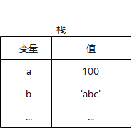
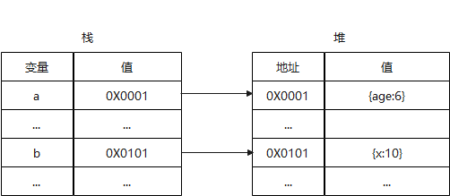
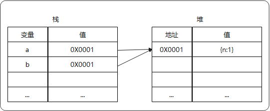
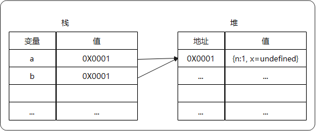
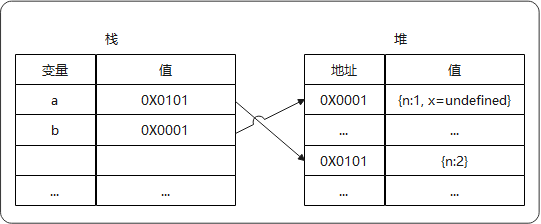
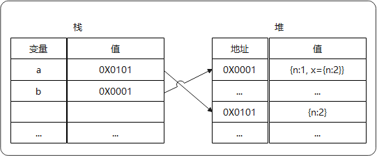

# JS

## 深浅拷贝

### 前置知识：JS数据类型

### 深浅拷贝基本概念

 1. 深拷贝和浅拷贝都是针对引用类型，值类型不存在该问题

    ```js
    // 值类型赋值操作
    let a = 1;
    let b = a;
    b = 3;
    console.log(a,b); // 1 3
    
    // 引用类型
    let obj1 = {age:6};
    let obj2 = obj1;
    obj2.age = 5;
    console.log(obj1,obj2); // Object { age: 5 } Object { age: 5 }
    ```

 2. 浅拷贝指只拷贝一层，深拷贝是无限层级拷贝，区别在于拷贝层级不同

### 常用拷贝方法

1. 浅拷贝

   1. `arr.slice(), arr.concat(), [...arr]`：数组，单层深拷贝

   2. `Object.assign({},obj)` ：对象，单层深拷贝

      ```js
      var arr = ['old', {old: 'old'}, ['old']];
      var new_arr = arr.concat();
      arr[0].old = 'new';
      arr[1][0] = 'new';
      new_arr[0] = 'new'
      console.log(arr) // ['old', {old: 'new'}, ['new']]
      console.log(new_arr) // ['new', {old: 'new'}, ['new']]
      ```

2. 深拷贝

   1. `JSON.parse(JSON.stringify())`：适用于拷贝数组/对象，不能拷贝`undefined`、`function`、`symbol`，存在爆栈问题，不能拷贝循环引用。

      ```js
      var arr = ['old', 1, true, ['old1', 'old2']]
      var new_arr = JSON.parse( JSON.stringify(arr) );
      console.log(new_arr);
      ```
      
   2. lodash中的`cloneDeep`：局限性，对于function类型，依然是引用；也没有深拷贝在原型链上的属性。
   
      [谨慎使用cloneDeep](https://www.136.la/shida/show-186889.html)

### 拓展1：实现浅拷贝

1. 思路：遍历原对象的属性，依次拷贝其值。

2. 源码

   ```js
   var shallowCopy = function(obj) {
       // 只拷贝对象
       if (typeof obj !== 'object') return;
       // 兼容数组拷贝
       var newObj = obj instanceof Array ? [] : {};
       for (var key in obj) {
           if (obj.hasOwnProperty(key)) {
               newObj[key] = obj[key];
           }
       }
       return newObj;
   }
   ```

### 拓展2：递归实现深拷贝

   1. 思路：拷贝的时候判断一下属性值的类型，如果是对象，**递归调用**深拷贝函数，否则直接拷贝值。

   2. 源码

      ```js
      var deepCopy = function(obj) {
          // 仅拷贝对象
          if (typeof obj !== 'object') return obj;
          // 兼容数组拷贝
          var newObj = obj instanceof Array ? [] : {};
          for (var key in obj) {
              if (obj.hasOwnProperty(key)) {  
                  // 属性值为“对象”时，递归调用，否则直接拷贝
                  newObj[key] = typeof obj[key] === 'object' ? deepCopy(obj[key]) : obj[key];
           }
          }
       return newObj;
      }
      ```

   3. 局限：

         1. 存在递归爆栈问题

         2. 只适用于数组、对象的深拷贝，不兼容`ES6`之后的`set, map, weakset, weakmap`

         3. 不能拷贝循环引用

         4. 存在引用丢失问题

   4. 拓展：判断是否为“对象”

      ```js
      Object.prototype.toString.call(obj) === '[object Object]' // 仅 {} 返回true，（推荐）
      obj.constructor === Object // {} 返回true
      obj instanceof Object // {},[] 返回true
      typeof obj[key] === 'object' // {},[],null 返回true
      ```

### 拓展3：解决递归拷贝爆栈问题

1. 思路：改用循环、消除尾递归（这里不适用）

   1. 首先

3. 源码

   ```js
   function cloneDeep5(x) {
       const root = {};
       const loopList = [
           {
               parent: root,
               key: undefined,
               data: x,
           }
       ];
   
       while(loopList.length) {
           // 广度优先
           const node = loopList.pop();
           const parent = node.parent;
           const key = node.key;
           const data = node.data;
   
           // 初始化赋值目标，key为undefined则拷贝到父元素，否则拷贝到子元素
           let res = parent;
           if (typeof key !== 'undefined') {
               res = parent[key] = {};
           }
   
           for(let k in data) {
               if (data.hasOwnProperty(k)) {
                   if (typeof data[k] === 'object') {
                       // 下一次循环
                       loopList.push({
                           parent: res,
                           key: k,
                           data: data[k],
                       });
                   } else {
                       res[k] = data[k];
                   }
               }
           }
       }
   
       return root;
   }
   ```

4. 局限：无法拷贝循环引用，存在引用丢失问题

5. 思考：如何兼容数组？

### 拓展4：解决循环引用的拷贝问题（待补充）

1. 思路：
   1. 借助哈希表，存储已拷贝过的对象，每次拷贝前进行检测，已存在则直接取出。
2. 源码

### 拓展5：解决引用丢失问题（待补充）

### 参考资料

- [js变量类型（一）值类型和引用类型](https://blog.csdn.net/qq_25503949/article/details/107136659)
- [JavaScript专题之深浅拷贝](https://github.com/mqyqingfeng/Blog/issues/32)
- [深拷贝的终极探索](https://juejin.cn/post/6844903692756336653)
- [【进阶4-3期】面试题之如何实现一个深拷贝 #29](https://github.com/yygmind/blog/issues/29)

## 连续赋值

### 前置知识：JS数据类型

1. JS中的数据类型可分为值类型（基本类型）和引用类型

2. 值类型：

   1. 存储在栈中

      

   2. 变量赋值操作，会对值进行拷贝，2变量互不影响

   3. 常见“值类型” （7种）

      ```js
      let a; // undefined
      let b = 'abc'; // String
      let c = 1; // Number
      let d = true; // Boolean
      let e = null // null
      let e = Symbol('sy'); // Symbol, ES6
      BigInt // 大于 253 - 1 的整数, ES10
      ```

3. 引用类型

   1. 在栈中存储地址，在堆中存储值

      

   2. 变量赋值操作，仅进行地址拷贝，2变量共享一份数据，互相影响

   3. 常见“引用类型”

      ```js
      let a = {age:20};
      let b = [1,2,3];
      function f(){};
      ```

### 赋值规则

1. 如果赋的值是引用类型，则最终指向同一个对象
3. 连续赋值，每个节点最终赋值取决于最后一个等号的右边值
4. 出现多个赋值操作符"="时，运算顺序为从右向左

### 运算符优先级&运算顺序

1. 运算符优先级： `=` 的优先级是除了 `,` 以外最低的；从右向左结合
2. 运算顺序：从左向右 （感兴趣的，可以了解下 AST生成器，执行顺序简单来说是按AST后序遍历，[AST生成器](https://resources.jointjs.com/demos/javascript-ast)）

### 经典例题

1. 示例

   ```js
   let a = { n: 1 };
   let b = a; 
   a.x = a = { n: 2 };
   console.log(a, b); // { n: 2 } { n: 1, x: { n: 2 } }
   ```

2. 解析

   1. 前两行代码，执行结果

      

   2. 第3行代码，根据运算符的优先级，可视为`a.x = (a = { n: 2 });`；根据运算顺序，从左到右执行。

      1. 首先执行 `a.x =`：`a.` 访问的为堆中的变量（即真实对象），为其添加`x`属性，由于未赋值，默认为`undefined`。

         

      2. 其次执行 `a = {n:2}`：`a =`访问的为栈中的地址（即引用），相当于创建一个新的对象`{n:2}`，并将其“地址”，赋值给a，即a指向新对象`{n:2}`。

         

      3. 最后将第2步的结果赋值给 `a.x `：即将`a`的引用赋值给`x`，因此`x`指向`{n:2}`。
   
         


3. 思考：若将第3行代码改为` a = a.x = { n: 2 };`，结果如何？

### 参考资料

1. [从一次连续赋值体验搞懂JavaScript存储与赋值](https://juejin.cn/post/6921690852888690696)
2. [JavaScript连续赋值的执行顺序问题](https://blog.csdn.net/weixin_44179269/article/details/113915734)
3. [Javascript 连续赋值的问题深究](https://www.coder.dog/javascript/js-continuous-assignments-problem.html)

## 防抖、节流

### 前置知识

1. 闭包
2. call/bind/apply
3. 计时器：`setTimeout, setInterval`

### 背景

1. 背景：浏览器的 `resize`、`scroll`、`keypress`、`mousemove` 等事件在触发时，会不断地调用绑定在事件上的回调函数；再比如输入框的联想搜索功能，用户的每次修改，都会触发资源的请求。
2. 目的：为减少资源浪费、提升前端性能、优化用户体验，需要对这类事件进行调用次数的限制。

### 防抖 debounce

#### 概念

1. 业界：规定在事件被触发n秒后再执行回调，如果在这n秒内又被触发，则重新计时。
2. 个人理解：针对会被频繁**触发**的事件，保证事件**连续执行前**，经历了**固定的闲置时间**。（**“闲置时间”只与“触发”操作有关系**，被触发则打破“闲置”，重新计时）。

#### 实现：非立即执行

1. 功能：无论是否首次触发，均在执行前设置“闲置时间”。（非立即执行）

2. 思路

   1. 利用计时器，函数首次执行时设定一个计时器
   2. 之后函数若被触发，判断是否已设定过计时器。若有，则清空并重设定时器。当计时器结束时，触发函数执行。

3. 源码

   ```js
   /* 
   * @param {Function} fun
   * @param {Number} delay 闲置时间
   */
   function debounce(fun, delay) {
   	// 通过闭包缓存一个计时器
   	let timer = null;
   	// 将处理结果当作函数返回,触发事件回调时执行这个返回函数
   	return function(...args) {
   		// 如果已经设定过计时器就清空上一次的计时器
   		if (timer) clearTimeout(timer);
   		// 设定一个新的计时器，定时器结束后执行函数
   		timer = setTimeout(() => {
   			fun.apply(this, args);
   		}, delay);
   	};
   }
   
   const write1 = () => console.log('curTime1:', new Date());
   const write2 = () => console.log('curTime2:', new Date());
   console.log('curTime:', new Date());
   setInterval(debounce1(write1, 500), 1000);
   setInterval(debounce1(write2, 2000), 1000);
   ```

   > 解析：首次间隔1.5S开始输出，之后每隔1S输出一次22行内容。

#### 实现：可立即执行

1. 功能：首次触发后立即执行，非首次触发，设置“闲置”时间。

2. 思路：计时器为空表示”首次触发“，结合传参，控制是否立即执行。

3. 源码

   ```js
   /* 
   * @param {Function} fun
   * @param {Number} delay 闲置时间
   * @param {Boolean} immediate true立即执行
   */
   function debounce(fun, delay, immediate) {
       let timer = null
       return function(...args) {
           if (timer) clearTimeout(timer)
         	// immediate=true 表示第一次触发后即执行；timer 为空表示首次触发
           if (immediate && !timer) {
               fun.apply(this, args)
           }
           timer = setTimeout(() => {
               fun.apply(this, args)
           }, delay)
       }
   }
   ```

### 节流 throttle

#### 概念

1. 业界：规定在一个单位时间内，只能触发一次函数。如果这个单位时间内触发多次函数，只有一次生效。
2. 个人理解：针对会被频繁**触发**的事件，保证事件**连续执行**前，经历了**最小间隔时间**。（**“间隔时间”只与“上次执行”操作有关系**，不受“触发”操作影响）

#### 应用

1. 鼠标的点击事件；滚动条的滚动监听事件。

#### 实现：利用时间戳

1. 功能：首次触发后立即执行，最后一次触发停止后，不会再执行。

2. 思路

   1. 首次触发，初始化“最近一次时间戳”为0。
   2. 每次触发事件，判断间隔时间（当前时间-最近一次时间戳）是否已经达到时间差 。如果是则执行回到，并更新“最近一次时间戳”。

3. 源码

   ```js
   /* 
   * @param {Function} fun 需要节流的方法
   * @param {Number} delay 最小间隔时间
   */
   function throttle(fun, delay) {
   	// 上一次执行 fun 的时间
   	let previous = 0;
   	// 将处理结果当作函数返回,触发事件回调时执行这个返回函数
   	return function(...args) {
   		// 获取当前时间，转换成时间戳，单位毫秒
   		let now = +new Date();
   		// 执行方法，并将历史时间戳置为now
   		if (now - previous > delay) {
   			previous = now;
   			fun.apply(this, args);
   		}
   	};
   };
   
   let write = function () {
     console.log('curTime:', new Date().toLocaleString('zh', { hour12: true }))
   }
   setInterval(throttle(write,1000),100); // 每隔1s输出一次
   // setInterval(throttle(write,1000),2000); // 每隔2s输出一次
   ```

   > 解析：通过对比23,24行输出结果发现，节流保证的是最小间隔时间。


#### 实现：利用计时器

1. 功能：首次触发后，不会立即执行，间隔时间后才会执行。最后一次触发停止后，仍会再执行一次。

2. 思路

   1. 事件初次触发/计时器为空，设置定时器。
   2. 此后再触发该事件，若计时器已存在，则等到计时结束时执行回调，并清空计时器；否则不执行。

3. 源码

   ```js
   function throttle(func, delay) {
   	let timer;
   	return function(...args) {
       // 计时器不存在，则设置计时器
   		if (!timer) {
   			timer = setTimeout(() => {
           // 计时结束，清空计时器，并执行回调
   				timer = null;
   				func.apply(this, args);
   			}, delay);
   		}
   	};
   }
   ```

### 拓展1：underscore中的实现

1. 防抖功能描述 `_.debounce(function, wait, [immediate])`
   1. 基础防抖功能
   2. 是否忽略首次间隔时间：`immediate=true`立即执行
   3. 手动关闭防抖功能：在`debounce`函数上调用`.cancel()`
2. 防抖实现原理：待补充
3. 节流功能描述` _.throttle(function, wait, [options])`
   1. 基础节流功能
   2. 是否响应首次触发：默认首次触发立即执行，可通过`{leading: false}`关闭
   3. 是否响应最后一次触发：`trailing=true`表示最后一次触发后，执行回调;
   4. 手动关闭节流功能：在`throttle`函数上调用`.cancel()`
   5. 注意：`leading,trailing不能同时为false`

4. 节流的实现原理：待补充

5. 参考资料：[API](https://underscorejs.net/#debounce)，[源码](https://github.com/jashkenas/underscore/tree/master)

### 拓展2：lodash中的实现

1. 防抖功能描述：`debounce(func, wait, [options])` 
   1. options可选参数，分别是 `leading`、`trailing` 和 `maxWait`（`maxWait`表示最大等待时间，实现节流效果，保证大于一定时间后一定能执行）
   2. 基础防抖功能
   3. 是否响应首次触发：默认首次触发立即执行，可通过`leading= false`关闭
   4. 是否响应最后一次触发：`trailing=true`表示最后一次触发后，执行回调;
2. 防抖实现原理：待补充
3. 节流功能描述：`throttle(func, wait, options)`，`options`可选参数，分别是 `leading`、`trailing`。
4. 节流实现原理：调用内置防抖函数，设置`maxWait=wait`

### 参考资料

1. [7分钟理解JS的节流、防抖及使用场景](https://juejin.cn/post/6844903669389885453#heading-4)
2. [防抖和节流原理分析](https://juejin.cn/post/6844903662519599111?utm_medium=fe&utm_source=weixinqun)
3. [JavaScript专题之跟着 underscore 学节流](https://github.com/mqyqingfeng/Blog/issues/26)
4. [深入浅出防抖节流](https://muyiy.vip/blog/7/7.4.html#%E9%98%B2%E6%8A%96%E5%87%BD%E6%95%B0-debounce)

## promise

## Axios、Ajax、Fetch

### 异步请求的演进

1. **XMLHttpRequest对象**：现代浏览器，最开始与服务器交换数据，都是通过`XMLHttpRequest`对象。它可以使用JSON、XML、HTML和text文本等格式发送和接收数据。

   1. **优点：**
      - 不重新加载页面的情况下更新网页
      - 在页面已加载后从服务器请求/接收数据
      - 在后台向服务器发送数据。
   2. **缺点：**
      - 使用起来也比较繁琐，需要设置很多值。
      - 早期的IE浏览器有自己的实现，这样需要写兼容代码。

2. jQuery ajax：对`XMLHttpRequest`对象的封装。

   1. **优点：**
      - 对原生`XHR`的封装，做了兼容处理，简化了使用。
      - 增加了对`JSONP`的支持，可以简单处理部分跨域。
   2. **缺点：**
      - 如果有多个请求，并且有依赖关系的话，容易形成**回调地狱**。
      - 本身是针对MVC的编程，不符合现在前端MVVM的浪潮。
      - ajax是jQuery中的一个方法。如果只是要使用ajax却要引入整个jQuery非常的不合理。

3. fetch： 提供了一个获取资源的接口（包括跨域请求）。Fetch 的核心在于**对 HTTP 接口的抽象**，包括 Request、Response、Headers 和 Body，以及用于初始化异步请求的 `global fetch`。

   1. **优点：**
      -  **跨域的处理**
      - 是底层API，代替`XHR`，可以轻松处理各种格式，非文本化格式。
   2. **缺点：**
      - `fetch`只对网络请求报错，对`400`，`500`都当做成功的请求，需要封装去处理
      - `fetch`默认不会带`cookie`，需要添加配置项。
      - `fetch`不支持`abort`，不支持超时控制，使用`setTimeout`及`Promise.reject`的实现超时控制并不能阻止请求过程继续在后台运行，造成了流量的浪费。
      - `fetch`没有办法原生监测请求的进度，而`XHR`可以。

4. `axios`：是一个基于`promise`的HTTP库，可以用在浏览器和 `node.js` 中。它本质也是对原生`XMLHttpRequest`的封装，只不过它是`Promise`的实现版本，符合最新的ES规范。

   1. **优点：**

      - 从浏览器中创建`XMLHttpRequests`
      - 可在 `node.js` 中使用
      - 支持 `Promise API`
      - 提供了并发请求的接口
      - 拦截请求和响应
      - 转换请求数据和响应数据
      - 取消请求
      - 自动转换 `JSON` 数据
      - 客户端支持防御 `XSRF`

      **缺点：**

      - 只支持现代浏览器


### vue中axios封装

1. 引入

2. 创建实例

3. 根据环境设置baseURL，axios.defaults.baseURL可以设置axios默认请求地址

4. 统一设置请求头

5. 跨域、超时、响应码处理

6. 请求、响应处理

7. 拦截器

   ```js
   import axios from 'axios'
   // 创建实例
   const service = axios.create({
     baseURL: process.env.NODE_ENV === 'production' ? `/` : '/apis',
     // 设置请求头
     headers: {
       get: {
         'Content-Type': 'application/x-www-form-urlencoded;charset=utf-8'
       },
       post: {
         'Content-Type': 'application/json;charset=utf-8'
       }
     },
     // 是否跨站点访问控制请求
     withCredentials: true,
     // 超时
     timeout: 30000,
   })
   
   // 请求拦截器
   service.interceptors.request.use((config) => {
   	return config
   }, (error) => {
       // 错误抛到业务代码
       return Promise.resolve(error)
   })
   
   // 响应拦截器
   service.interceptors.response.use((response) => {
    return response
   }, (error) => {
       // 错误抛到业务代码
       return Promise.resolve(error)
   })
   export default service
   ```


### 参考资源

1. [有同学问我：Fetch 和 Ajax 有什么区别？](https://juejin.cn/post/6997784981816737800)
2. [异步网络请求xhr、ajax、fetch与axios对比](https://juejin.cn/post/6844904058466074637)
3. [聊聊 Vue 中 axios 的封装](https://juejin.cn/post/6844903969152565261)
4. [vue中Axios的封装和API接口的管理](https://juejin.cn/post/6844903652881072141)

### 参考资料

1. [手写promise](https://www.jianshu.com/p/49f5f6ea812b)

## JS数据类型

1. JS中的数据类型可分为值类型（基本类型）和引用类型

2. 值类型：

   1. 存储在栈中

      

   2. 变量赋值操作，会对值进行拷贝，2变量互不影响

   3. 常见“值类型” （7种）

      ```js
      let a; // undefined
      let b = 'abc'; // String
      let c = 1; // Number
      let d = true; // Boolean
      let e = null // null
      let e = Symbol('sy'); // Symbol, ES6
      BigInt // 大于 253 - 1 的整数, ES10
      ```

3. 引用类型

   1. 在栈中存储地址，在堆中存储值

      

   2. 变量赋值操作，仅进行地址拷贝，2变量共享一份数据，互相影响

   3. 常见“引用类型”

      ```js
      let a = {age:20};
      let b = [1,2,3];
      function f(){};
      ```

      

## 计时器

#### setTimeout超时调用

1. 功能：在定时器到期后执行一个函数或指定的一段代码。
2. 参数说明：`var timeoutID = scope.setTimeout(func[, delay]);`
   1. 返回值：计时器编号，可以传递给[`clearTimeout()`](https://developer.mozilla.org/zh-CN/docs/Web/API/clearTimeout)来取消该计时器。
   2. func：要超时执行的函数
   3. delay：默认值0，意味着“马上”执行，或者尽快执行。非0，表示在该事件过去后，将该任务加入执行队列。（**具体执行时间看队列情况**）
3. 取消计时器：`clearTimeout(timeoutID)`

#### setInterval间歇调用

1. 功能：重复调用一个函数或执行一个代码段，直至间歇调用被取消或页面被卸载，在每次调用之间具有固定的时间延迟。（使用时要注意取消）

2. 参数说明：`var intervalID = scope.setInterval(func, )`

   1. 返回值：计时器编号，可以传递给`clearTimeout()`来取消该计时器。
   2. func：要重复调用的函数。
   3. delay：每次调用所需延迟的毫秒数，如果这个参数值小于10，则默认使用值为10。请注意，真正延迟时间或许更长。

3. 取消计时器：`clearInterval(timeoutID)`

   > 注意：`setTimeout()`和`setInterval()`用一个计时器编号池，技术上，`clearTimeout()`和 `clearInterval()`可以互换。但是，为了避免混淆，不要混用取消定时函数。

4. 对比：通常情况下，很少真正使用间歇调用，因为后一个间歇调用可能在前一个间歇调用结束之前调用。因此，通常会使用超时调用来模拟间歇调用。

## 待学习

1. 模块导入、导出
2. 方法内return 方法：[解析](https://www.cnblogs.com/keyi/p/6733393.html)
3. 闭包：执行回调方法时，将引用该方法及其变量环境。[解析](https://blog.csdn.net/weixin_42165445/article/details/100899287)
4. apply
5. json.stringify的问题:https://segmentfault.com/q/1010000040622953

