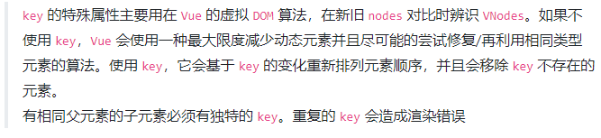

## 1. VUE

### 1.1. 基础知识

1. 计算属性特点？能否用箭头函数定义？更改了getter里使用的变量，是否会触发computed的更新?
   1. 不使用箭头函数：this指向为“vue实例”。
   2. 箭头函数：this指向为window。
   
2. computed和watch 1.的区别？ computed和methods区别？

3. vue常用的事件修饰符？
   
   1. .prevent: 提交事件不再重载页面；.stop: 阻止单击事件冒泡；.self: 当事件发生在该元素本身而不是子元素的时候会触发；.capture: 事件侦听，事件发生的时候会调用。
   
4. vue中 key 值的作用？

    1. 作用：确保元素的重新渲染。
    2. 原理：v-for 更新已渲染过的元素列表时，默认“就地复用”策略。如果数据项的顺序被改变，Vue 将不会移动 DOM 元素来匹配数据项的顺序， 而是简单复用此处每个元素，并且确保它在特定索引下显示已被渲染过的每个元素。key的作用主要是为了高效的更新虚拟DOM。

    

5. Vue中data的定义方式有哪几种？区别？（{}，return{}）

6. vue常用的指令?（for, if, else, show, on, bind, model, slot）

7. v-if 和 v-show 区别?

8. v-on 可以绑定多个方法吗？（可以）

   1. 一个元素可以绑定多个事件；
      `<button @mouseenter="onEnter" @mouseleave="onLeave">鼠标进来</button>`
   2. 一个事件也可以绑定多个函数，按顺序执行； 
      `<button @click="onEnter(),onLeave ()">点我onEnter onLeave </button>`

9. 如何自定义指令，它的生命周期是什么？

10. 点击页面空白区域，如何阻止输入框失焦？

11. data的属性可以和methods中的方法同名吗？为什么？

12. 怎么缓存当前的组件？缓存后如何获取数据？怎么更新？

     1. 方法：keep-alive，重新进入组件/页面时，不会重载组件，也不会触发组件的created，而是从缓存中读取&加载。
     2. 获取数据：（1）keep-alive缓存的组件被激活时，都会执行actived钩子函数，在其中获取数据。（2）组件渲染时，会执行`beforeRouteEnter`方法。

13. vue怎么实现强制刷新组件？如何触发组件的更新？Vue的更新机制？

     1. 强制刷新：`this.$forceupdate`。
     2. 触发更新的条件：data/props中定义+模板中使用+数据改变。
     3. 更新机制：vue实例化时，会为data中变量添加getter/setter。对于模板中使用的数据，会放入watcher中监测。改变后，触发更新。

14. 如何获取组件实例？（跨层级）

15. 通信方式？父子间、跨层级、兄弟间？通信、传值？

     1. 父子：props/emit; parent/children(直接); attr/listeners（间接，非响应式）；provide/inject（深层）。
     2. 兄弟：bus
     3. 不限：vuex

16. 插槽？作用域、动态、具名插槽？

     1. 作用：模板层，传递复杂内容
     2. 作用域插槽：
     3. 动态插槽：
     4. 具名插槽：

17. $nextTick作用？

      1. 作用：下次DOM更新循环结束后，**执行延迟回调**。
      2.  使用场景：在Vue生命周期的created()钩子函数进行的DOM操作一定要放在Vue.nextTick()的回调函数中，因为此时dom没进行渲染；

18. 页面中定义一个定时器，在哪个阶段清除？为何要销毁？（`destroy`）

19. Vue的生命周期有哪几个？作用？

    

20. Vuex如何使用？

        [vuex相关面试题1](https://juejin.cn/post/6844903993374670855)，[面2](https://zhuanlan.zhihu.com/p/163283018)

21. vuex核心概念（store)

     1. 取值：state、getter
     2. 赋值：mutation、actions
     3. 模块化：module

22. [路由管理面1](https://www.cnblogs.com/keoy/p/13585881.html)

23. Vue router的两种模式分别是？有什么区别？（hash和history）

24. $route和$router的区别？

    1. `$router`：是“路由实例”对象，包括了路由的跳转方法（`.resolve(), .push`），钩子函数等。
       
    2. `$route`：当前router的跳转对象，“路由信息对象”，包括`path，params，hash，query，fullPath，matched，name`等路由信息参数。

25. params与query传参的区别？

    1. 是否在地址栏展示：query相当于get请求，会展示；params不会。
    2. 搭配不同：query+path，params和name，对应取值也不同。

26. 怎么定义 vue-router 的动态路由? 怎么获取传过来的值？
       在 router 目录下的 index.js 文件中，对 path 属性加上 /:id，使用 router 对象的 params.id 获取。

27. 怎么实现路由/组件的懒加载（按需加载）

       1. vue 异步组件实现懒加载

          ```javascript
          // 路由懒加载
          myCom : resolve=>(require(['需要加载的路由的地址'])，resolve)
          // 组件懒加载
          components:{
              "One-com":resolve=>(['./one'],resolve)
          }
          ```
    
       2. ES中的`import`方法（推荐）

          ```javascript
          // 路由懒加载
          const HelloWorld = ()=>import("@/components/HelloWorld")
          // 组件懒加载
          const One = ()=>import("./one");
           components:{
              "One-com":One
           },
          ```
          

### 1.2. 扩展知识

1. 为何不用html+css+jQuery？（vue更适用用户频繁操作的场景）

2. vue等单页面应用及其优缺点？

   1. 优点：实现无刷新替换、响应式数据绑定、操作简洁。
   2. 缺点：不支持低版本浏览器；首页加载时间长；

3. vue特点？及定义？（虚拟DOM、数据的双向绑定、组件化开发）

   1. 双向绑定：MVVM设计模式。采用**数据劫持**结合**发布者-订阅者**模式的方式来实现，通过`Object.defineProperty( )`来劫持各个属性的`setter、getter`，在数据变动时，发布消息给**订阅者**，触发相应监听回调

4. 谈谈vue的diff算法？

5. 浏览器的渲染过程？

   构建dom树、生成样式表、构建render树、布局(坐标）、渲染。

6. 虚拟DOM及优势？（简化操作、性能更高）

7. vue如何优化首页的加载速度？

8. axios怎么解决跨域的问题？

9. 切换到新路由时，页面要滚动到顶部或保持原先的滚动位置怎么做呢？

## 2. JS

1. Var,let,const区别？解释一下变量的提升

2. 反引号作用？如何表示多行字符串？反引号中包含

3. JavaScript如何处理同步和异步情况？

4. 如何实现防抖、节流？（[链接](https://www.cnblogs.com/NanKe-Studying/p/13935763.html)）

   1. **防抖：**触发高频事件后n秒内函数只会执行一次，如果n秒内高频事件再次被触发，则重新计算时间

      解决方法：每次触发事件时都取消之前的延时调用方法

   2. **节流**：高频事件触发，但在n秒内只会执行一次，所以节流会稀释函数的执行频率

      解决方法：每次触发事件时都判断当前是否有等待执行的延时函数

5. 对象深浅拷贝？（`Object.assign`、slice、...、JSON、）

6. call, bind, apply区别？

7. 数组去重的方法？（set,reduce,filter)

8. 什么是可枚举属性？说说哪些是可枚举，哪些是不可枚举属性？如何得到可枚举属性？

9. 对象遍历的方法及区别？（for in, for of, for, forEach，Object.keys()）

10. 数组遍历常用方法：every() 、filter()、forEach()、map()、some()等

11. 什么是原型？原型链？JS如何实现继承？哪些会被继承？ 

    1. 原型链：每个实例对象，都有一个私有属性（`__proto__`），指向它的构造函数的原型对象（`prototype`）,该原型对象也有一个自己的原型对象( `__proto__`) ，层层向上直到一个对象的原型对象为 `null`。

12. 什么是闭包？ 作用？

    1. 闭包：有权访问另外一个函数作用域中的变量的函数。
    2. 作用：嵌套函数可访问声明于它们外部作用域的变量。

13. 什么是解构赋值？如何进行解构赋值？

14. 介绍下Promise？

    1. 作用：存储异步操作结果的容器；用于处理异步请求。
    2. 状态：pending（执行中）、success（成功）、rejected（失败）

15. Promise 和 async/await 和 callback的区别

    1. promise是ES6，async/await是ES7。
    2. async/await相对于promise来讲，写法更加优雅。是寄生于Promise，Generater的语法糖。
    3. reject状态的捕获：1）promise错误可以通过catch来捕捉 2）async/await既可以用.then又可以用try-catch捕捉。

16. 模块导出，Export,export default区别？

17. ES6与JS区别：JS预研的下一代标准，2015.6发布，为适应企业级大型应用程序；

18. 如何让浏览器兼容该特性：webpack-babel模块

19. this指向：

    1. 全局环境下：全局对象window。
    2. 普通函数内部：全局window（非严格模式）、undefined(严格模式)。
    3. 对象内部的方法，调用时：调用这些方法的对象。

20. JS使用typeof能得到哪些类型？（非数组 isInstanceOf、null、json对象）

21. ==和===推荐场景（判断属性是否存在时，用==）

22. 简单讲一下promise的使用？有多个请求，如何同时返回？promise.all的使用限制？async/await?（10个请求，如何同时返回？）

23. 原型链？

24. 更改this指向的方法？

## 3. CSS

1. 水平垂直居中的多种方式
2. 简单介绍一下CSS的盒子模型，包含几部分，分别指什么？
3. CSS选择符有哪些？优先级？
4. CSS可继承属性？不可继承属性有哪些？
5. 列出display的值，说明他们的作用？display：none和visibility：hidden的区别
6. position的值，relative和absolute分别是相对于谁进行定位的？absolute与fixed共同点与不同点

## 4. 浏览器

1. 网络请求码含义：200,304,403,500？
2. 如何防止CSRF攻击？
3. 页面的渲染过程？
4. 浏览器本地缓存：cookies，sessionStorage和localStorage的区别和使用场景

## 5. 性能优化

1. 如何实现分模块打包（webpack，loader，plugin）
1. 性能分析手段和常用措施
1. 路由懒加载，组件按需加载
1. 减少http请求
1. webpack压缩文件

## 5. 工程

### 5.1. webpack

1. 作用：

   1. 打包工具：将资源（js，css）打包到一个文件，通过一次请求获取；
   2. 构建功能：Loader模块
      1. Loader模块，会自动载入一个转换器（叫babel）, 使得浏览器可以将**ECMAScript6**转换成浏览器能支持的老版本JavaScript语言。
      2. 我们可以通过在Loader中编写特定的规则，来实现自动将这些**CSS预处理语言（Sass，Less，stylus）**转换成普通浏览器能识别的CSS代码。

2. 早期页面：html+css+js, 通过link标签将CSS引入你的HTML文件，以及通过Script标签的src属性引入外部的JS脚本。

3. 前端代码为什么要打包呢？（一次请求、拿到全部资源、使得网页加载更快）

   因为单页应用程序中用到很多**素材**，如果每一个素材都通过在HTML中以**src属性或者link**来引入，那么**请求一个页面**的时候，可能浏览器就**要发起十多次请求**，往往请求的这些资源都是一些**脚本代码或者很小的图片**，这些资源本身才几k，下载连1秒都不需要，但是由于HTTP是应用层协议，它的下层是TCP这个运输层协议，**TCP的握手和挥手过程消耗的时间可能比下载资源本身还要长**，所以需要把这些小文件全部打包成一个文件，这样只要**一次TCP**握手和挥手的过程，就把多个资源给下载下来了，并且多个资源由于都是**共享一个HTTP请求**，所以head等部分也是共享的，相当于形成了规模效应，**让网页展现更快**，用户体验更好。
   
4.  Webpack，有哪些常用的loader？有哪些常用的plugins？两者有什么不同？

5. Webpack热部署的原理？

6. 如何提高Webpack的构建速度？
### 5.2. Nodejs

1. 定义：是一个服务端的**JavaScript运行环境**，通过Node.js可以实现用JavaScript写独立程序。像我们之前提到的Webpack就是Node.js写的，所以作为一个前端开发，即使你不用Node.js写独立程序，也得配一个Node.js运行环境，毕竟很**多前端工具都是使用它写**的。
2. 作用：通常情况下，JavaScript的运行环境都是浏览器，因此**JavaScript的能力也就局限于浏览器能赋予它的权限了**。比如说读写本地系统文件这种操作，一般情况下运行在浏览器中的**JavaScript代码是没有这个操作权限**的。如果我们想用JavaScript写出一些能够运行在[操作系统](http://lib.csdn.net/base/operatingsystem)上的，能够具有像PHP，JAVA之类的编程语言具有的功能的程序该怎么办呢？Node.js就解决了这个问题。

### 5.3. NPM：

   1. 定义：是一个node.js的包管理器。

   2. 包的引入（原始方法）：我们在传统开发的时候，JQuery.js大多都是百度搜索，然后去官网下载，或者直接引入CDN资源，这种方法太过于麻烦。如果以后遇到其他的包，这个包的代码本身可能还调用了其他的包（也称这个包和其他的那几个包存在依赖关系），那么我们要在自己的项目中引入一个包将变得十分困难

   3. 使用npm进行包引入：会自动下载该包的依赖。

      `npm install xxx包名称`

### 5.4. Vue-CLi

1. 定义：vue.js的脚手架工具。
2. 作用：自动帮你生成好项目目录，配置好Webpack，以及各种依赖包的工具。
3. 安装：npm install vue-cli -g`

### 安全

- xss跨站脚本攻击（原理、如何进行的、防御手段是什么，要说清楚）
- CSRF跨站请求伪造（如何伪造法？怎么防御？等等都要说清楚
- 怎么去解决跨域问题

### 设计模式

- 前端开发中用到的设计模式

  - MVVM：

    - Model：代表数据模型，数据和业务逻辑都在Model层中定义；
    - View：代表UI视图，负责数据的展示；
    - ViewModel：就是与界面(view)对应的Model。因为，数据库结构往往是不能直接跟界面控件一一对应上的，所以，需要再定义一个数据对象专门对应view上的控件。而ViewModel的职责就是把model对象封装成可以显示和接受输入的界面数据对象。
    - Model和View并无直接关联，而是通过ViewModel来进行联系的，Model和ViewModel之间有着**双向数据绑定**的联系。

  
  
  

## 6. 其他

- 如何进行单元测试？

- 如何使用mock？

- 代码检视工具？提升开发效率的工具？

- 敏捷开发流程？


